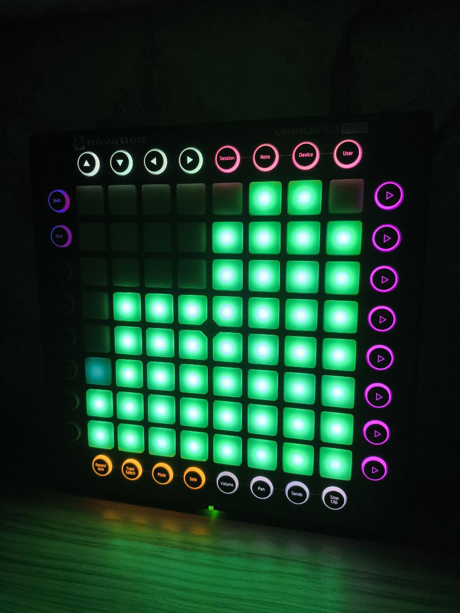
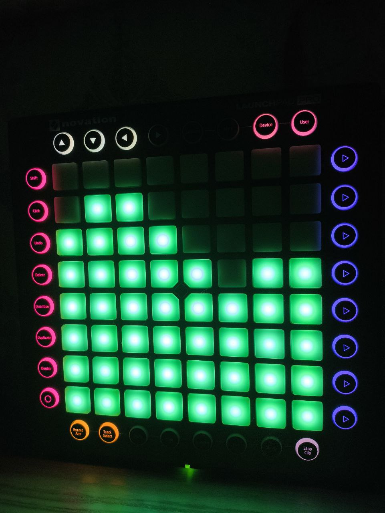

<!-- TODO: update readme (the prev version is about global EMA etc) -->
# 🎵 Launchpad Audio Visualizer

A real-time audio visualization system that transforms your music into stunning light shows on a Novation Launchpad Pro. Watch as bass drops, snares, and melodies come alive through dynamic RGB patterns synchronized to your audio.


<!-- JPG Demo visualization -->



## ✨ Features

- **🎨 Real-time Audio Visualization**: Live frequency analysis with smooth LED transitions
- **🧠 Psychoacoustic Weighting**: Natural sound perception modeling for more realistic visualization
- **🎛️ Multi-Zone Mapping**: Different frequency ranges mapped to distinct pad zones
- **🔊 Enhanced Side Button System**: Individual control for top, bottom, left, and right side buttons with split-zone functionality
- **⚡ High Performance**: Optimized async processing with intelligent caching and dual EMA smoothing
- **🎯 Smart Caching**: Prevents unnecessary LED updates for better performance
- **📊 Advanced Frequency Analysis**: 8-band spectrum analysis with psychoacoustic weighting (0Hz - 22kHz)
- **🎵 Universal Audio Input**: Works with any audio source - YouTube, Spotify, MP3 players, games, system audio
- **🔌 Audio Source Flexibility**: Compatible with PulseAudio monitor sources and Windows Stereo Mix
- **⚙️ Precision Signal Processing**: Configurable thresholds, EMA settings, and side button controls

## 🎯 Key Configuration Features

### **🧠 Psychoacoustic Weighting - Natural Sound Perception**
The **key improvement** of this system is the psychoacoustic weighting algorithm that models human hearing perception:

```python
PSYCHOACOUSTIC_WEIGHTS = [
    0.1,   # 0-100 Hz (Sub-bass - less perceptible)
    0.2,   # 100-200 Hz (Bass)
    0.4,   # 200-400 Hz (Low-mid)
    0.8,   # 400-800 Hz (Mid - more perceptible)
    1.5,   # 800-1600 Hz (Upper-mid - most perceptible)
    2.0,   # 1600-3200 Hz (Presence - peak sensitivity)
    1.8,   # 3200-6400 Hz (Brilliance)
    1.2    # 6400-22050 Hz (Air - reduced sensitivity)
]
```

- **Natural visualization**: Frequencies are weighted based on human hearing sensitivity
- **More realistic response**: Mid-range frequencies (800Hz-3.2kHz) get higher weights as they're most perceptible to human ears
- **Balanced output**: Prevents bass-heavy or treble-heavy music from dominating the visualization

### **⚙️ Dual EMA System - Advanced Signal Processing**
The `EmaConfig` uses a sophisticated dual-smoothing approach:

- **FAST_SMOOTHING (0.8)**: Quick response for detecting musical hits and transients
- **SLOW_SMOOTHING (0.05)**: Long-term average for normalization and baseline
- **Adaptive normalization**: Uses fast/slow ratio with tanh function for natural brightness curves
- **Noise filtering**: Hard threshold (0.08) eliminates background noise

### **🎛️ Enhanced Side Button System**
Individual control for each side button group with advanced features:

**Button Control Toggles:**
- `TURN_ON_TOP_BUTTONS`: Enable/disable top side buttons
- `TURN_ON_BOTTOM_BUTTONS`: Enable/disable bottom side buttons
- `TURN_ON_LEFT_BUTTONS`: Enable/disable left side buttons
- `TURN_ON_RIGHT_BUTTONS`: Enable/disable right side buttons

**Split-Zone Functionality:**
- **Top buttons**: Split into left (800-1600Hz) and right (3200-6400Hz) halves
- **Bottom buttons**: Split into mid (3200-6400Hz) and high (6400-22kHz) halves
- **SIDE_HALF_THRESHOLD [0.2, 0.3, 0.6, 0.7]**: Individual thresholds for each button in split zones

**Frequency Mapping:**
- **LEFT_SUB (0.3)**: Sub-bass frequencies (0-100Hz) with gradient colors
- **RIGHT_BASS (0.5)**: Bass frequencies (100-200Hz) with gradient colors
- **Split-zone processing**: Each half responds to different frequency ranges for more detailed visualization

## 🎮 Visualization Zones

### Main Pad Grid (8x7) (as indexes)
- **🔴 High Frequencies (1-2)**: Red LEDs for treble and cymbals
- **⚪ Mid Frequencies (3-5)**: White LEDs for vocals and instruments
- **🔵 Low Frequencies (6-8)**: Blue LEDs for bass and kick drums

### Side Buttons
- **Left Side**: Sub-bass responsive (0-100Hz) with blue-to-red gradient
- **Right Side**: Bass responsive (100-200Hz) with red-to-blue gradient
- **Top Buttons**: Split-zone - Left half (800-1600Hz) green-blue tones, Right half (3200-6400Hz) purple-pink tones
- **Bottom Buttons**: Split-zone - Left half (3200-6400Hz) orange tones, Right half (6400-22kHz) blue tones

## 🚀 Quick Start

### Prerequisites

- **Hardware**: Novation Launchpad Pro
- **OS**: Linux with PulseAudio or Windows with FFmpeg (OpenAL)
- **Python**: 3.11 or higher
- **FFmpeg**: Required for audio processing

#### FFmpeg Installation

**Linux (Ubuntu/Debian):**
```bash
sudo apt update
sudo apt install ffmpeg
```

**Linux (CentOS/RHEL/Fedora):**
```bash
# CentOS/RHEL
sudo yum install ffmpeg
# or for newer versions
sudo dnf install ffmpeg

# Fedora
sudo dnf install ffmpeg
```

**Windows:**
1. Download FFmpeg from [https://ffmpeg.org/download.html](https://ffmpeg.org/download.html)
2. Click on Windows then "Windows builds by BtbN"
3. Download the "ffmpeg-master-latest-win64-gpl.zip"
4. Extract to `C:\ffmpeg`
5. Add `C:\ffmpeg\bin` to your system PATH:
   - Open System Properties → Advanced → Environment Variables
   - Edit PATH variable and add `C:\ffmpeg\bin`
   - Restart command prompt/terminal (or your IDE)

**Verify installation:**
```bash
ffmpeg -version
```

### Installation

1. **Clone the repository**
   ```bash
   git clone https://github.com/Ev0b1t/launchpad_audio_visualizer
   cd launchpad_audio_visualizer
   ```

2. **Env setup and dependencies installation**
   ```bash
   python -m venv .venv
   source .venv/bin/activate
   pip install -r requirements.txt
   ```

3. **Connect your Launchpad Pro** via USB

4. **Find your audio source**
   ```bash
   pactl list sources | grep -E "(Name:|Description:)"
   ```

5. **Configure audio source**:

   **For Linux (PulseAudio):**
   ```python
   # In core/config.py
   MONITOR_SRC: str = 'your_audio_source_name.monitor' # or 'stereo mix'
   DEVICE: str = 'pulse' # or 'openal'
   ```

   **For Windows (FFmpeg):**
   ```bash
   # List available audio devices
   ffmpeg -list_devices true -f dshow -i dummy
   # or
   ffmpeg -list_devices true -f openal -i dummy

   # Find your audio device and update config
   # Enable "Stereo Mix" in Windows Sound Settings > Recording tab
   ```

### Usage

**Basic usage:**
```bash
python -m main.py
```

**With performance profiling:**
```bash
python -m main.py --profiling
```

**Stop visualization:**
Press `Ctrl+C` to stop and automatically clear all LEDs.

## ⚙️ Configuration

### Audio Settings (`core/config.py`)

```python
@dataclass(frozen=True)
class AudioConfig:
    MONITOR_SRC: str = 'alsa_output.pci-0000_00_1f.3.analog-stereo.monitor' # or Stereo Mix (from ffmpeg output)
    DEVICE: str = 'pulse' # or 'openal'
    SAMPLERATE: int = 44100
    CHUNK_SIZE: int = 1024
    CHANNELS: int = 2
```

### Color Customization

```python
@dataclass(frozen=True)
class ColorConfig:
    # Main pad colors (unified cyan-teal theme)
    RGB_LOW = (0, 63, 31)   # Cyan-teal for bass
    RGB_MID = (0, 63, 31)   # Cyan-teal for mids
    RGB_HIGH = (0, 63, 31)  # Cyan-teal for highs

    # Side button gradients
    LEFT_START_RGB = (0, 0, 63)    # Blue start
    LEFT_END_RGB = (63, 0, 0)      # Red end
    RIGHT_START_RGB = (63, 0, 0)   # Red start
    RIGHT_END_RGB = (0, 0, 63)     # Blue end

    # Dynamic colors for split-zone buttons
    TOP_RGB = (0, 0, 63)           # Blue base
    BOTTOM_RGB = (31, 31, 31)      # Gray base
```

### Sensitivity Tuning

```python
@dataclass(frozen=True)
class ThresholdConfig:
    LEFT_SUB: float = 0.3      # Sub-bass sensitivity (0-100Hz)
    RIGHT_BASS: float = 0.5    # Bass sensitivity (100-200Hz)
    TOP_BASS: float = 0.9      # Top button trigger (800-1600Hz)
    TOP_SUB: float = 0.9       # Top button trigger (3200-6400Hz)
    BOTTOM_HIGH: float = 0.7   # Bottom button trigger (3200-6400Hz)
    BOTTOM_MID_HIGH: float = 0.7  # Bottom button trigger (6400-22kHz)

    # Split-zone thresholds for individual buttons
    SIDE_HALF_THRESHOLD: [0.2, 0.3, 0.6, 0.7]  # Individual button thresholds
```

## 🏗️ Project Structure

```
launchpad_audio_visualizer/
├── core/
│   ├── capture_audio.py      # Audio capture and processing
│   ├── config.py            # Configuration dataclasses
│   ├── laucnhpad_visualization.py  # LED control and caching
│   ├── constants.py         # Psychoacoustic weights and constants
│   └── state.py             # Global state management
├── utils/
│   ├── general.py           # Utility functions
│   └── logger.py            # Logging configuration
├── assets/
│   ├── launchpad_cheat_sheet.txt
│   └── launchpad_color_codes.png
├── main.py                  # Entry point
├── requirements.txt         # Dependencies
└── pyproject.toml          # Project metadata
```

## 🔧 Technical Details

### Audio Processing Pipeline

1. **Capture**: Real-time audio capture via PulseAudio
2. **FFT Analysis**: Fast Fourier Transform for frequency decomposition
3. **Band Extraction**: 8-band frequency analysis with RMS calculation
4. **Smoothing**: Exponential moving average for smooth transitions
5. **Mapping**: Frequency-to-LED coordinate mapping
6. **Caching**: Smart LED state caching to minimize hardware calls

### Performance Optimizations

- **Async Processing**: Non-blocking audio processing
- **LED Caching**: Only update changed LEDs
- **Batch Operations**: Grouped LED updates
- **Memory Efficient**: Optimized data structures

### Frequency Bands

| Band | Frequency Range | Typical Content |
|------|----------------|-----------------|
| 0    | 0-100 Hz       | Sub-bass, kick drums |
| 1    | 100-200 Hz     | Bass, low fundamentals |
| 2    | 200-400 Hz     | Bass, male vocals |
| 3    | 400-800 Hz     | Midrange, vocals |
| 4    | 800-1.6 kHz    | Upper midrange |
| 5    | 1.6-3.2 kHz    | Presence, clarity |
| 6    | 3.2-6.4 kHz    | Brilliance, sibilance |
| 7    | 6.4-22 kHz     | Air, harmonics |

## 🐛 Troubleshooting

### Common Issues

**Launchpad not detected:**
```bash
# Check USB connection
lsusb | grep Novation

# Verify MIDI ports
python -c "import launchpad_py as lp; l=lp.LaunchpadPro(); print(l.ListAll())"
```

**No audio visualization:**

*Linux:*
```bash
# Check PulseAudio sources
pactl list sources short

# You can see something like ""64	alsa_output.pci-0000_05_00.6.analog-stereo.monitor	PipeWire	s32le 2ch 48000Hz	SUSPENDED""
# Copy the name of the source you want to use
# The suspend mode means that the source is not active, so you need to run
# When you will use the source it will be active as "IDLE" mode.
```

*Windows:*
```bash
# Check FFmpeg audio devices
# (dshow or openal for the best audio quality and speed)
ffmpeg -list_devices true -f dshow -i dummy
ffmpeg -list_devices true -f openal -i dummy

# Enable Stereo Mix in Sound Settings:
# Right-click sound icon > Sounds > Recording tab > Enable "Stereo Mix"
# Set as default recording device for best quality
```

**Performance issues:**
- Reduce `CHUNK_SIZE` in config
- Lower `SAMPLERATE` if needed
- Use `--profiling` flag to identify bottlenecks

**ALSA device configuration errors:**
If you use the ALSA device and get an error about config in the sounddevice (when you trying to find laucnhpad port or connect to him), you need to check your alsa.conf in the file path `/usr/local/share/alsa`. Make sure that `alsa` is not a file but a directory, then into the directory the `alsa.conf` needs to be included (you can rename alsa as alsa.conf then mkdir alsa and copy the alsa.conf into the alsa directory). You can use the `alsa.conf` from the `assets/` directory in this project.

**Notice:**
The project already provide the port scanning function, so you don't need to do it manually.

### LED Issues

**Pads stay lit after stopping:**
- The `clear_all_pads()` function automatically resets all LEDs
- Manual reset: Press Ctrl+C or call `lp.Reset()`

**Incorrect colors:**
- Check frequency band ranges in config
- Verify color mappings match your preferences

## 👨‍💻 Author

**Created by Ev0b1t**
- 🐦 **Twitter/X**: [@Ev0b1t](https://x.com/Den4kD77967)
- 💻 **GitHub**: [@Ev0b1t](https://github.com/Ev0b1t)

## 🤝 Contributing

1. Fork the repository
2. Create a feature branch (`git checkout -b feature/amazing-feature`)
3. Commit your changes (`git commit -m 'Add amazing feature'`)
4. Push to the branch (`git push origin feature/amazing-feature`)
5. Open a Pull Request

## 📄 License

This project is licensed under the MIT License - see the [LICENSE](LICENSE) file for details.

---

**Third-Party Libraries:**

This project uses the following third-party libraries:

- **pygame** - Copyright (C) 2024 by the Pygame community. This library is licensed under the GNU Lesser General Public License v2.1. A copy of the LGPL v2.1 license can be found here: https://www.gnu.org/licenses/old-licenses/lgpl-2.1.html. Source code for Pygame can be found at: https://github.com/pygame/pygame.

## 🙏 Acknowledgments

- [launchpad-py](https://github.com/FMMT666/launchpad.py) - Launchpad control library
- [NumPy](https://numpy.org/) - Numerical computing
- [PulseAudio](https://www.freedesktop.org/wiki/Software/PulseAudio/) - Audio system
- [FFmpeg](https://ffmpeg.org/) - Cross-platform audio/video processing

---

**Made with ❤️ for music visualization enthusiasts by Ev0b1t**

*Turn your Launchpad into a mesmerizing audio-reactive light show!*


## 💰 Support the Project

If you enjoy this project and want to support its development:

> **Note**: QR codes for crypto donations will be added for each crypto currency.

### 💳 Traditional Payment Methods (Freedom BANK)
- **Freedom CARD**
  - **Card Number**: `4002 8900 3818 6791`
  - **USD**: `KZ55551S600096063USD`

### 🎯 Other Ways to Support (Crypto Donations below)
- ⭐ **Star this repository** on GitHub
- 🐛 **Report bugs** and suggest features
- 💻 **Contribute code** improvements
- 📢 **Share** with other music enthusiasts

### 🪙 Crypto Donations
- **Bitcoin (BTC)**: `142P1jgPoT7X9DPQQLt7VcsNqqUvU76viN` (Bitcoin Network - supports addresses starting with "1", "3", "bc1p", "bc1q")
- **Ethereum (ETH)**: `0xdd267505dee5dcd91bbe1c288e8c786675fd9946` (ERC20 Network)
- **Solana (SOL)**: `FfotaUXXJGMaQQLU37R2DKYSoPLJsnDZRK7FELxTe38E` (Solana Network)
- **USDT (TRC20)**: `TEVZeeK83QdQFxUTGk9hUi3MgCrbwSCfDY` (TRC20 Network)
- **TON**: `EQD5mxRgCuRNLxKxeOjG6r14iSroLF5FtomPnet-sgP5xNJb` (TON Network)
  - **TON MEMO ID**: `171164246`


